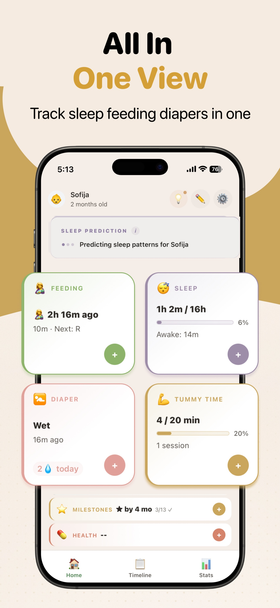
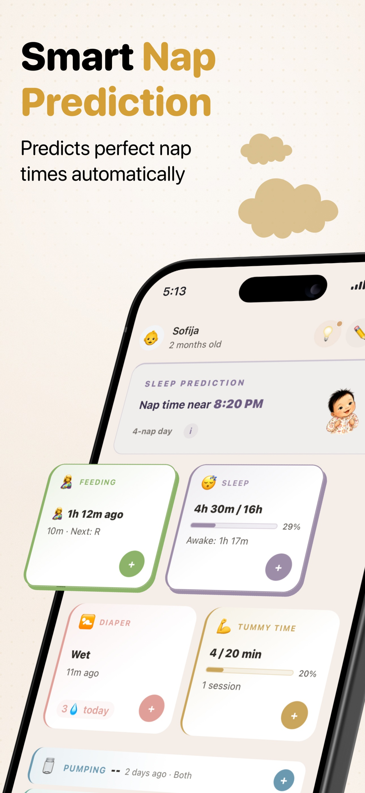
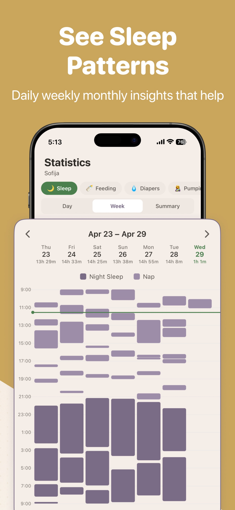
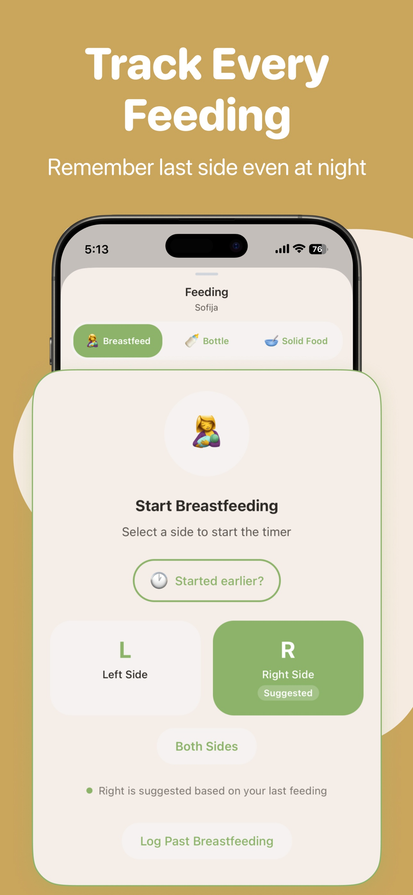
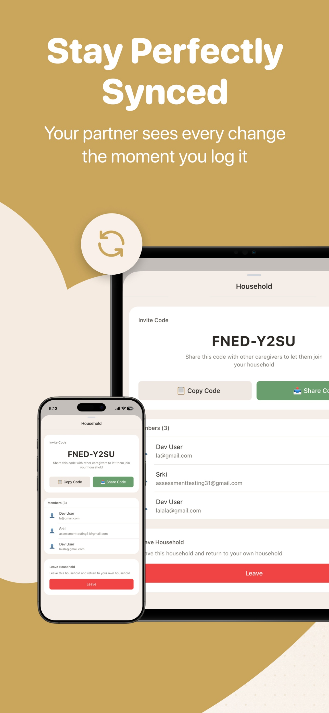

# Sofi — Baby Tracker

A production baby tracking app for iOS and Android, built with React Native. Offline-first architecture with a custom sync engine, real-time multi-caregiver collaboration, iOS widgets, Apple Watch app, and Live Activities.

Free. No ads. No subscriptions.

<p>
  <a href="https://apps.apple.com/it/app/sofi-baby-tracker/id6758142736">
    
  </a>
  <a href="https://play.google.com/store/apps/details?id=com.sofibaby.app&hl=en">
    
  </a>
</p>

<p align="center">
  
  
  
  
  
</p>

## Tech Stack

| Layer | Technology |
|-------|-----------|
| Framework | React Native, Expo SDK 54 |
| Language | TypeScript (strict mode) |
| Backend | Supabase (PostgreSQL, Auth, Realtime, Edge Functions) |
| Styling | NativeWind v4 (Tailwind CSS for React Native) |
| Navigation | Expo Router v6 (file-based) |
| State | React Context + Reducers |
| i18n | i18next (7 languages) |
| Testing | Vitest (unit), Jest (component), Maestro (E2E) |

## Architecture

### Offline-First Sync Engine

All writes go to local storage first and are immediately reflected in the UI. A persistent sync queue handles server delivery with retry logic and exponential backoff. On foreground resume, the queue flushes before pulling server state to avoid overwriting optimistic updates. Activity pulls fetch remote rows before entering a per-user, per-baby storage lock. Inside the lock, they re-read pending operations and local entries so a refresh cannot replace a queued create or update or resurrect a queued delete.

```
User action → Local storage → UI update (immediate)
                ↓
           Sync queue → Supabase (async, retries on failure)
                ↓
           Realtime subscription → Other household devices
```

### Real-Time Multi-Caregiver Sync

Supabase Realtime subscriptions push changes between household members instantly. Remote changes dispatch into React context reducers (`REMOTE_INSERT`, `REMOTE_UPDATE`, `REMOTE_DELETE`). Insert acknowledgements upsert by entity ID, so a server event and its matching local create result produce one activity regardless of arrival order. Device ID filtering prevents echo updates.

### Timer Exclusivity

Household-wide timer locks via Supabase RPC (`acquire_timer_lock`) prevent simultaneous timers per baby and activity type across all devices. Server controls verify the authenticated caregiver and baby household; only the caregiver who started a timer can pause, resume, or release it. If the lock service is unavailable, feeding, sleep, pumping, and tummy-time timers continue locally and keep their reconciliation state through restart. Reconnect attempts to acquire the missing lock. When two offline timers compete, the first successful lock acquisition wins. The other timer is saved to the timeline, and its caregiver sees what happened. Unregistered solo users keep timers on their device and do not use server locks. Timer starts reserve a stable completion ID, so repeated Stop actions return the first saved activity instead of creating another one. External Stop requests from widgets and Apple Watch stay in a versioned queue until matching timer completions are durable, even if several arrive while the app is closed. While a timer is being saved, the dashboard replaces its Stop and pause controls with a disabled "Stopping..." state. If the save fails, the controls return and the app shows an error. Failed lock cleanup retries against the original timer instance and cannot release a newer timer. Stale locks auto-expire after 12 hours.

### iOS Native Integrations

- **WidgetKit** home screen widgets with push-triggered timeline refresh via APNs
- **Live Activities + Dynamic Island** for active feeding and sleep timers
- **Apple Watch** companion app using WCSession with REST API fallback
- **Deep linking** (`sofibaby://`) for widget and notification actions

### Edge Functions

Deno-based serverless functions for direct APNs push delivery, feeding reminders, wake window alerts, and Live Activity management. All push notifications use direct APNs (not Expo Push API).

## Project Structure

```
app/                        # Expo Router screens (tabs, settings, activities)
src/
├── components/             # UI components, charts, stats cards
├── contexts/               # ~20 feature-scoped context providers + reducers
├── services/
│   ├── sync/               # Sync engine, real-time sync, queue, conflict resolver
│   └── ...                 # Storage, notifications, watch, widget, household
├── hooks/                  # Timer alerts, duplicate detection, accessibility
├── i18n/                   # Translation files (en, sr, es + 3 more)
├── utils/                  # Growth helpers, temperature, retry logic
└── types/                  # TypeScript definitions
supabase/
├── functions/              # Edge Functions (Deno)
└── migrations/             # PostgreSQL migrations through 056
targets/widget/             # iOS WidgetKit extension (Swift)
e2e/                        # Maestro E2E tests
```

## Development

```bash
nvm use
npm ci
npm start
```

Required environment variables are listed in `.env.example` with safe placeholders.

```bash
# iOS (requires CocoaPods)
npx expo prebuild --platform ios --clean && npx expo run:ios

# Android
npx expo prebuild --platform android --clean && npx expo run:android
```

## Testing

```bash
npm run check                # Complete non-device validation before a pull request
npm run check:code           # The same validation without local database checks
npm run test:unit            # 2,200+ Vitest unit tests
npm run test:component -- --runInBand # Jest component tests
npm run test:security        # Security tests
npm run test:sync            # Sync tests
npm run test:ci              # CI workflow and required-check contract tests
npm run test:sql:setup       # Reset local Supabase and apply all migrations
npm run test:sql             # PostgreSQL merge and authorization tests
npm run test:edge:timer      # Local timer RPC and Edge authorization flow
npm run typecheck            # TypeScript strict mode
npm run lint                 # ESLint (warnings fail the quality gate)
npm run e2e:household-timers       # Fast iOS offline reconnect and caregiver handoff
npm run e2e:household-timers:clean # Clean local provisioning and the same scenario
```

`npm run check` requires Docker and `psql`. Its SQL stage resets the local database at `127.0.0.1:54322` and applies the committed migrations. It does not connect to a linked or production Supabase project. Run `test:sql:setup` before the SQL and timer Edge checks when using the focused commands.

Pull requests and pushes to `main` run the non-device checks as separate GitHub Actions jobs. Configure `Non-device checks required` as the required branch-protection check. Test jobs retain their logs as artifacts for seven days.

The fast iOS command reuses the installed E2E app and local fixtures. The scenario stops local Supabase API access while the owner starts sleep. It restores the API, restarts each observing app before checking server state, and continues the two-caregiver handoff. The clean command resets local Supabase and builds the app for two named simulators before running the same scenario. It removes fixture accounts when finished. Both require Docker, Xcode, Maestro, and `psql`; clean provisioning also needs `jq` and CocoaPods. See [`e2e/README.md`](e2e/README.md) for setup and diagnostics, including the local-only safeguards.

## License

MIT
